# Documentação Técnica do Frontend

## 1. Introdução

### Nome do projeto
**ShopPobre UI** (`shopobre-ui`)

### Descrição geral
O projeto **ShopPobre UI** é o frontend de uma aplicação de comércio eletrônico desenvolvida com foco em usabilidade, separação de responsabilidades e integração com serviços REST. A interface atende dois perfis principais de uso:

- **Cliente (USER):** navegação de catálogo, busca, carrinho, dados de conta/endereço, pedidos e pagamento.
- **Administrador (ADMIN):** manutenção de produtos, categorias, estoque e pedidos por meio de área administrativa dedicada.

Do ponto de vista arquitetural, o frontend foi estruturado para facilitar evolução incremental do produto, com componentes reutilizáveis, serviços de domínio isolando chamadas HTTP e roteamento com controle de acesso por autenticação e perfil.

### Tecnologias utilizadas
- **Angular 20** (arquitetura standalone components)
- **TypeScript**
- **Angular Router**
- **Angular HttpClient**
- **RxJS**
- **Angular Signals** (estado e reatividade local)
- **SCSS**
- **Bootstrap 5**
- **Font Awesome**
- **SweetAlert2**
- **Stripe.js** (fluxo de pagamento)

---

## 2. Estrutura do Projeto

### Organização de pastas
A base do frontend está em `FRONTEND-PROJETO-WEB2/shopobre-ui/src/app`, organizada por camadas:

- `core/`
  - **services/**: integrações HTTP e regras de negócio de domínio (auth, users, orders, products etc.).
  - **models/**: contratos e tipagens.
  - **guards/**: proteção de rotas por autenticação/perfil.
- `pages/`
  - telas de navegação (rotas), incluindo fluxos públicos, autenticados e administrativos.
- `shared/components/`
  - biblioteca interna de componentes reutilizáveis de interface e formulário.

Complementos relevantes:
- `app.routes.ts`: mapa central de rotas.
- `app.config.ts`: providers globais (ex.: `provideHttpClient`, `provideRouter`).
- `environments/`: configuração de ambiente e URL base da API (`http://localhost:3000/api` em desenvolvimento).

### Lógica de organização
O projeto adota uma estratégia de **modularização por responsabilidade funcional**:

- **Páginas** orquestram fluxo e composição visual.
- **Componentes compartilhados** concentram UI reutilizável.
- **Serviços** concentram integração e manipulação de dados externos.
- **Guardas** centralizam critérios mínimos de acesso às áreas protegidas.

Esse desenho reduz acoplamento entre interface e comunicação HTTP, melhora manutenibilidade e permite evolução por domínio (ex.: catálogo, pedidos, pagamentos) sem impactos excessivos em outras áreas.

---

## 3. Design da Interface (UI/UX)

### Ferramentas de prototipagem
O design da interface foi concebido e consolidado no **Figma**, servindo como referência visual para definição de layout, identidade e fluxo de navegação do sistema.

- Protótipo principal: [Figma - Shopobre](https://www.figma.com/design/RcmfjDMl6bplH8hqLdPeHc/Shopobre?node-id=1-2&t=8S3tfT93xkrdT6hB-1)

### Diretrizes visuais e de experiência
A proposta visual adota uma linha moderna com foco em legibilidade, consistência e velocidade de interação:

- **Hierarquia visual clara:** separação explícita entre cabeçalho, conteúdo principal e rodapé.
- **Padronização de componentes:** formulários, tabelas, botões e cartões com comportamento previsível.
- **Fluxo orientado à tarefa:** caminhos curtos para ações críticas (buscar produto, comprar, gerenciar pedido/estoque).
- **Consistência entre perfis:** identidade visual única para módulo do cliente e painel administrativo, com variações de layout por contexto de uso.
- **Ênfase em ações primárias:** destaque cromático para botões de decisão (ex.: login, salvar alterações, checkout).

### Inserção das principais telas do sistema

#### 3.1 Área pública e catálogo (cliente)

**Home (início do catálogo):**
- `images-figma/tela-incial-home.png`
- `images-figma/tela-final-home.png`

As telas da Home mostram o posicionamento da vitrine principal de produtos, segmentação por categorias, navegação superior com busca global e rodapé institucional. A divisão em blocos de destaque reforça descoberta de produtos e orientação do usuário durante a navegação.

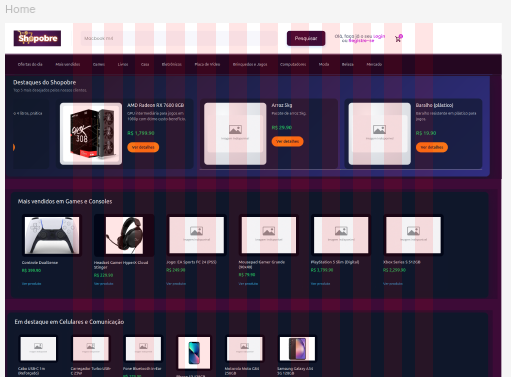
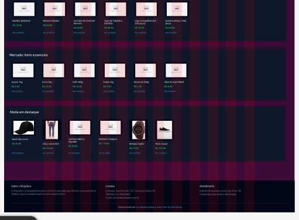

**Detalhe do produto:**
- `images-figma/tela-product-id.png`

Apresenta galeria de imagens (miniaturas + imagem principal), título, preço, descrição e controles de quantidade/ação de compra. Essa tela concentra os elementos decisórios de conversão em compra.

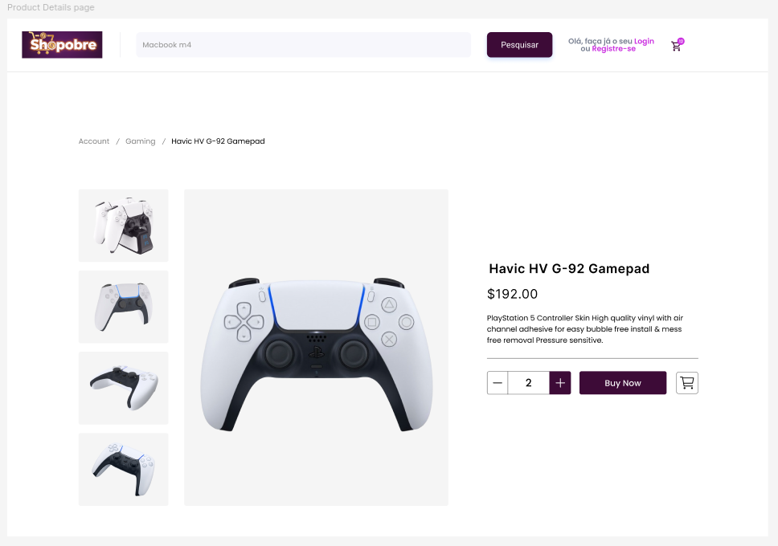

**Carrinho de compras:**
- `images-figma/tela-carrinho.png`

A interface de carrinho prioriza leitura rápida dos itens, ajuste de quantidades, subtotais por produto e resumo financeiro final, incluindo CTA para avanço do checkout.

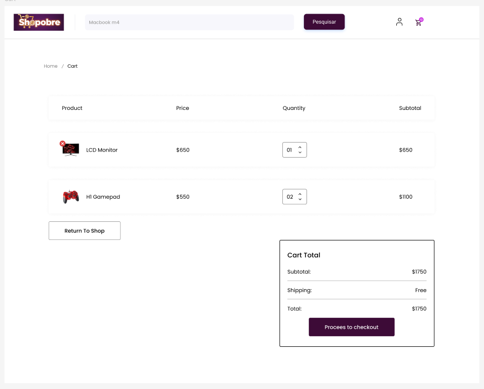

#### 3.2 Autenticação e cadastro

**Login:**
- `images-figma/tela-login.png`

Estrutura com split layout (área institucional + formulário), focada em acesso rápido do usuário e transição direta para cadastro quando necessário.

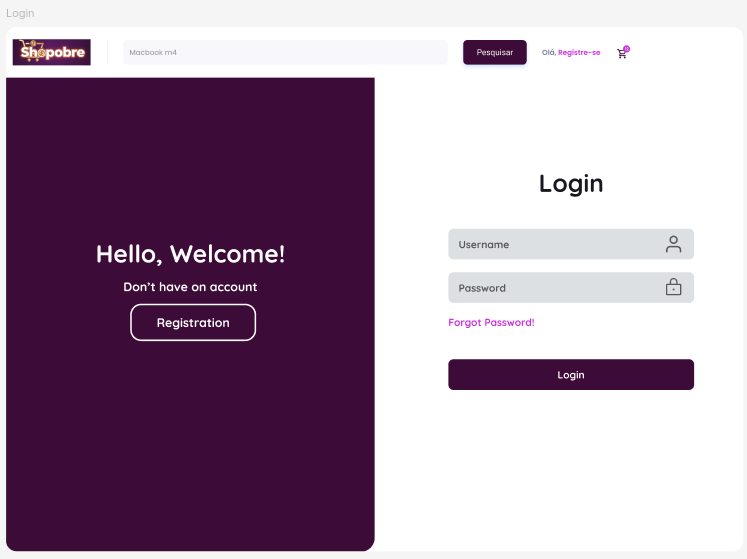

**Registro de usuário:**
- `images-figma/tela-registration.png`

Tela de cadastro com campos essenciais (nome, e-mail, CPF, telefone e senha), mantendo consistência visual com login e reduzindo curva de aprendizado no processo de entrada na plataforma.

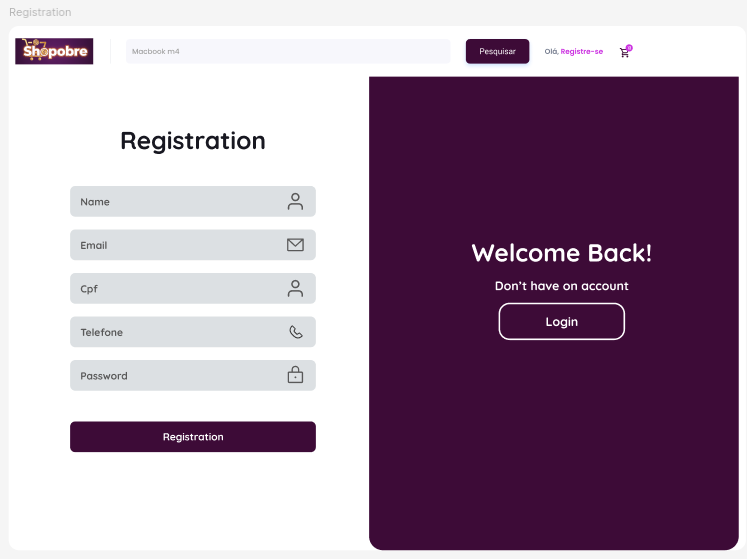

#### 3.3 Área autenticada do usuário

**Perfil do usuário (minha conta):**
- `images-figma/tela-perfil-usuario.png`

Permite edição de dados cadastrais e atualização de credenciais. O layout favorece revisão segura das informações pessoais com ação de confirmação explícita.

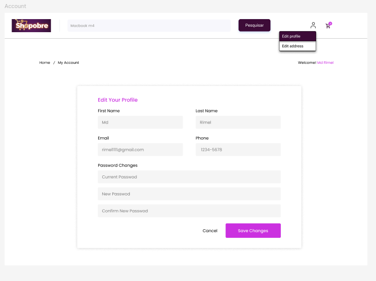

**Endereço do usuário:**
- `images-figma/tela-address-usuario.png`

Tela orientada a dados logísticos (rua, número, CEP, cidade, estado e tipo), essencial para viabilizar o fluxo de entrega e finalização de pedidos.

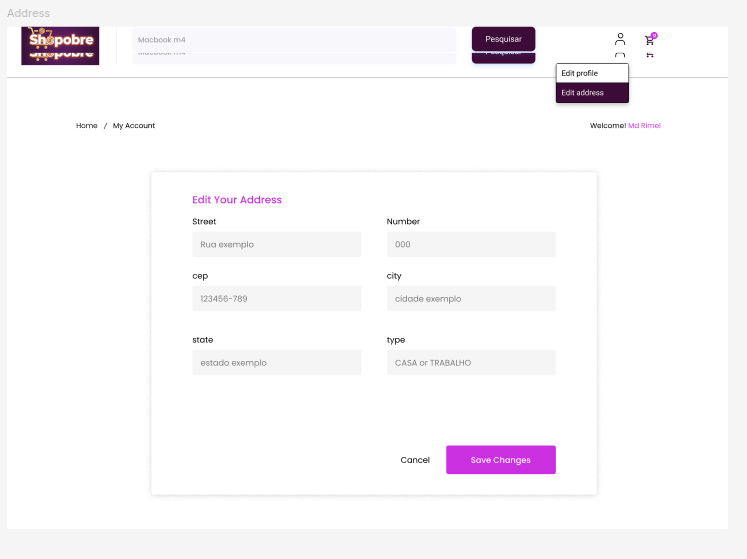

**Pedidos do usuário (listagem):**
- `images-figma/tela-pedido-usuario.png`

Visão consolidada do histórico de compras com status, total e paginação, permitindo acompanhamento da jornada pós-compra.

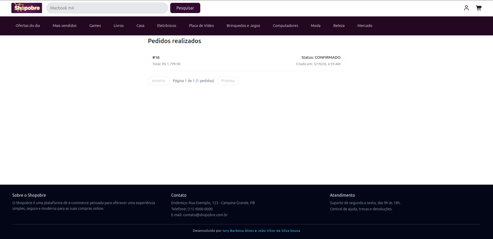

**Detalhe de pedido do usuário:**
- `images-figma/tela-pedido-id-usuario.png`

Exibe dados completos do pedido: resumo, comprador, endereço de entrega e itens. Funciona como ponto de consulta operacional e transparência da transação.

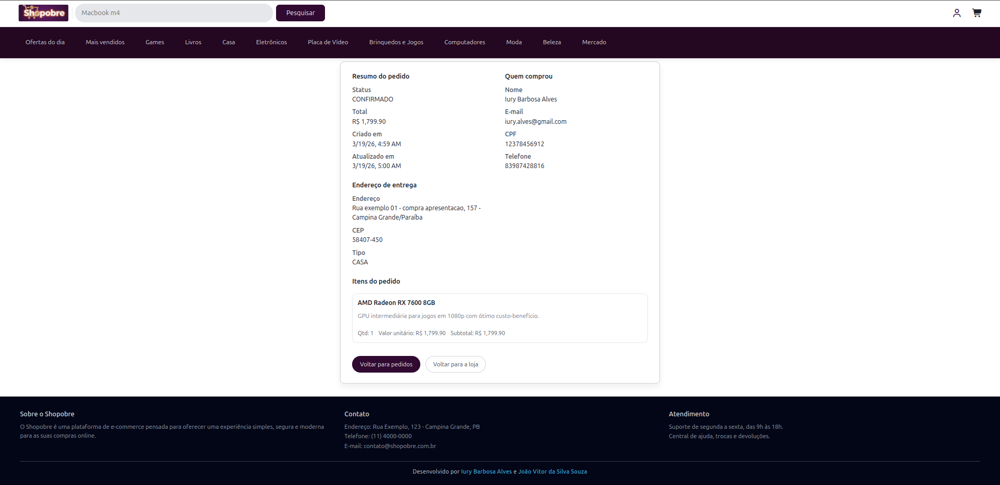

#### 3.4 Módulo administrativo

**Produtos (visão administrativa):**
- `images-figma/tela-admin-product.png`
- `images-figma/tela-adim-lista-product.png`

As telas mostram tabela de gestão com busca, status e ações por item (edição/remoção), além de CTA para criação de novo produto. O padrão tabular favorece operação em volume.

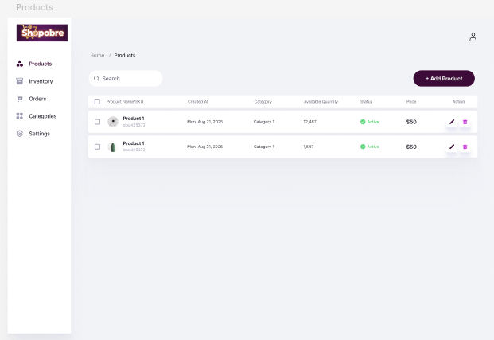
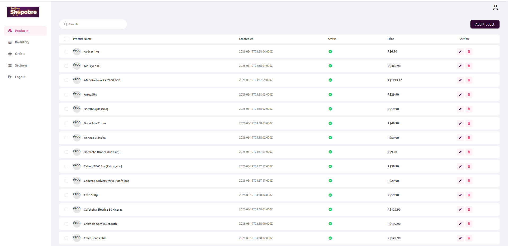

**Criação/Edição de produto (admin):**
- `images-figma/tela-admin-criar-product.png`

Tela de formulário administrativo para cadastro/edição, com organização em campos objetivos e ação primária de persistência.

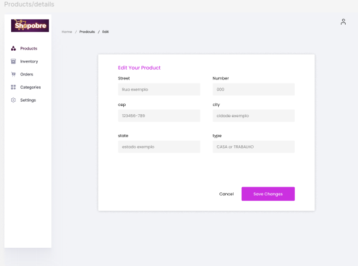

**Gestão de estoque (admin):**
- `images-figma/tela-admin-inventory.png`

Interface operacional para acompanhamento de quantidades e ajustes rápidos de estoque, mantendo controle sobre disponibilidade no catálogo.

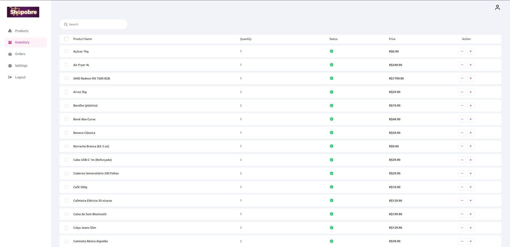

**Gestão de pedidos (admin):**
- `images-figma/tela-admin-pedidos.png`

Painel de monitoramento de pedidos com status e ações administrativas, importante para governança do ciclo de atendimento.

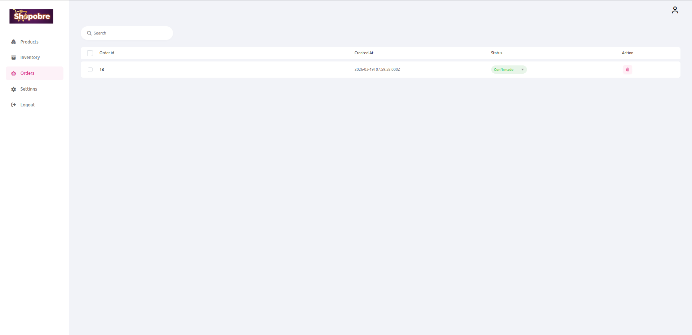

### Considerações de UI/UX para evolução
Com base no protótipo e nas telas inseridas, o frontend demonstra uma base de experiência consistente para e-commerce. Como próximos passos de maturidade em design, recomenda-se:

1. Definir um mini design system formal (tokens de cor, tipografia, estados de botão e espaçamento).
2. Expandir diretrizes de acessibilidade (contraste, navegação por teclado, feedbacks de erro e foco visível).
3. Incluir variações responsivas documentadas por breakpoint (desktop/tablet/mobile).
4. Padronizar microinterações de loading/sucesso/falha para jornadas críticas (checkout e área admin).

---

## 4. Componentização

### Componentes principais
Os componentes reutilizáveis mais relevantes estão em `shared/components`, com destaque para:

- **Layout e navegação**
  - `header/`: navegação principal, categorias, busca, acesso a conta/carrinho.
  - `footer/`: rodapé global.
  - `breadcrumb/`: trilha de navegação.
  - `side-bar/` e `top-nav-bar/`: navegação da área administrativa.

- **Formulários e interação**
  - `form-input/`: campo base reutilizável.
  - `login-form/` e `signup-form/`: encapsulam entrada e validações para autenticação.
  - `form-edit/`: bloco reutilizável para edição de entidades.
  - `actions-footer/`: ações padrão de formulário (ex.: salvar/cancelar).

- **Domínio de catálogo e operação**
  - `product-form/`: cadastro/edição de produtos e manipulação de imagens.
  - `product-list/` e `product-list-card/`: listagem administrativa de produtos.
  - `inventory-list/` e `inventory-list-card/`: gestão de estoque.
  - `order-list/` e `order-list-card/`: gestão e acompanhamento de pedidos.

### Reutilização e modularização
O frontend aplica padrões que favorecem escalabilidade:

- **Separação entre componente de lista e componente de item**, melhorando reaproveitamento e testes.
- **Padronização de blocos de formulário**, reduzindo duplicação de markup/validação.
- **Encapsulamento de lógica de integração em serviços**, evitando chamadas HTTP diretas em múltiplas telas.
- **Uso de Signals e RxJS por cenário**, combinando simplicidade de estado local com poder de composição assíncrona.

Resultado prático: maior previsibilidade de manutenção, menor custo de evolução de requisitos e facilidade para onboarding técnico.

---

## 5. Integração com Backend

### API utilizada
O frontend consome a API do backend com base configurada em:

- `environment.apiUrl = http://localhost:3000/api`

O cliente HTTP utilizado é o `HttpClient` nativo do Angular, com autenticação via token JWT armazenado em sessão.

### Endpoints consumidos no frontend
Principais endpoints utilizados pelos serviços e páginas:

#### Autenticação e conta
- `POST /auth/login` — autenticação e obtenção de token.
- `POST /users` — cadastro de usuário.
- `GET /users/:id` — consulta de dados do usuário.
- `PUT /users/:id` — atualização de dados da conta.

#### Endereços
- `GET /users/:id/addresses` — listagem de endereços do usuário.
- `POST /users/:id/addresses` — criação de endereço.
- `PUT /users/:id/addresses/:addressId` — atualização de endereço.

#### Catálogo e produtos
- `GET /categories` — listagem de categorias.
- `GET /categories/:id` — categoria por ID.
- `POST /categories` — criação de categoria (admin).
- `GET /products` — listagem de produtos.
- `GET /products/:id` — detalhe de produto.
- `POST /products` — criação de produto (admin).
- `PUT /products/:id` — edição de produto (admin).
- `DELETE /products/:id` — exclusão de produto (admin).
- `POST /products/:id/images` — upload de imagem (admin).
- `DELETE /products/:id/images/:imageId` — remoção de imagem (admin).

#### Estoque
- `GET /inventory/:productId` — consulta de estoque.
- `PATCH /inventory/:productId/increase` — incremento de estoque (admin).
- `PATCH /inventory/:productId/decrease` — decremento de estoque (admin).

#### Pedidos
- `POST /orders` — criação de pedido.
- `GET /orders` — listagem geral de pedidos (admin).
- `GET /orders/:id` — pedido por ID.
- `GET /orders/:id/details` — detalhes completos do pedido.
- `GET /orders/user/:userId` — pedidos do usuário autenticado.
- `PUT /orders/:id` — atualização de status/endereço (admin).
- `DELETE /orders/:id` — remoção de pedido (admin).

#### Pagamentos
- `GET /config` — obtenção de chave pública Stripe para inicialização do checkout.
- `POST /payments` — criação de intenção de pagamento (`clientSecret`).
- `GET /payments/by-order/:orderId` — recuperação de `clientSecret` por pedido.

### Estratégia de consumo
- O token é enviado em `Authorization: Bearer <token>` para rotas protegidas.
- A aplicação diferencia consumo de rotas por papel (`USER` e `ADMIN`) com base em guardas e fluxo de navegação.
- O checkout integra o `clientSecret` ao Stripe no frontend para confirmação de pagamento.

### Observações técnicas de integração
- Não há interceptor HTTP global para injeção de token/tratamento unificado de erros; hoje os headers são montados em serviços específicos.
- O backend mantém CORS fixado em `http://localhost:4200`, o que deve ser considerado em deploy/staging.
- Há formatos de erro parcialmente heterogêneos no backend; recomenda-se normalização no frontend para UX consistente.

---

## 6. Roteamento

### Explicação das rotas
O roteamento está centralizado em `app.routes.ts` e pode ser dividido em três grupos.

### Rotas públicas
- `/home`
- `/search`
- `/category/:slug`
- `/cart`
- `/product/:id`
- `/login`
- `/signup`

### Rotas autenticadas (guardadas por `authGuard`)
- `/account`
- `/address`
- `/orders`
- `/orders/:id`
- `/checkout/payment/:orderId`

### Rotas administrativas
Prefixo base: `/admin`  
Proteção adicional por perfil (`roles: ['ADMIN']`):

- `/admin/products`
- `/admin/products/add`
- `/admin/products/edit/:id`
- `/admin/account`
- `/admin/inventory`
- `/admin/orders`

### Como as páginas são acessadas
- **Navegação declarativa:** via `routerLink` em componentes de layout e menus.
- **Navegação imperativa:** via `router.navigate(...)` em fluxos de autenticação, busca, ações administrativas e checkout.
- **Controle de acesso:** feito no cliente por guarda de rota que valida autenticação e papel para entrada em áreas restritas.

---

## 7. Conclusão

### Aprendizados principais
Durante o desenvolvimento, o projeto evidencia aprendizados importantes de engenharia frontend:

- Estruturação de aplicações SPA por camadas (`core`, `pages`, `shared`) para aumentar legibilidade e manutenção.
- Construção de componentes reutilizáveis com fronteiras bem definidas.
- Implementação de autenticação e autorização no cliente com proteção de rotas por perfil.
- Integração de fluxos de e-commerce ponta a ponta (catálogo, carrinho, pedido e pagamento).
- Uso combinado de Signals e RxJS para tratar estado local e dados assíncronos de forma pragmática.

### Desafios enfrentados e soluções encontradas
- **Desafio:** conciliar múltiplos fluxos (cliente e admin) em uma mesma aplicação.
  - **Solução:** separação de rotas, layouts e componentes por contexto de uso.

- **Desafio:** manter consistência de integração com diversas entidades de API.
  - **Solução:** serviços por domínio e centralização da base de API por ambiente.

- **Desafio:** preservar experiência de usuário em operações sensíveis (ex.: atualização de status, exclusões, checkout).
  - **Solução:** uso de feedbacks visuais (SweetAlert2), validações e redirecionamentos controlados.

- **Desafio:** gestão de permissões no frontend.
  - **Solução:** guarda de rota com validação de token e papéis para evitar acesso indevido às telas administrativas.

### Melhorias futuras planejadas
Com base na análise técnica, as evoluções recomendadas para maior maturidade do frontend são:

1. Implementar **HTTP interceptor** para token, refresh e padronização de tratamento de erro.
2. Criar **normalizador único de erros** para mensagens mais consistentes ao usuário.
3. Reduzir duplicação de lógica entre páginas de catálogo (home, busca, categoria) por meio de camada de facades/queries.
4. Ampliar cobertura de testes para cenários críticos de integração e autorização.
5. Revisar consistência de rotas/links e mapeamentos de slug para evitar inconsistências de navegação.
6. Formalizar guia de convenções (arquitetura, nomenclatura e padrões de estado) para sustentar crescimento da equipe.

---

## Considerações finais

O frontend do ShopPobre demonstra uma base técnica sólida para um sistema de e-commerce acadêmico-profissional, com elementos de arquitetura moderna, integração real com backend e separação adequada de responsabilidades. A evolução natural do projeto passa por padronização transversal (interceptors, erros, testes e governança de componentes), o que elevará ainda mais robustez, previsibilidade operacional e qualidade de entrega em contextos corporativos.
